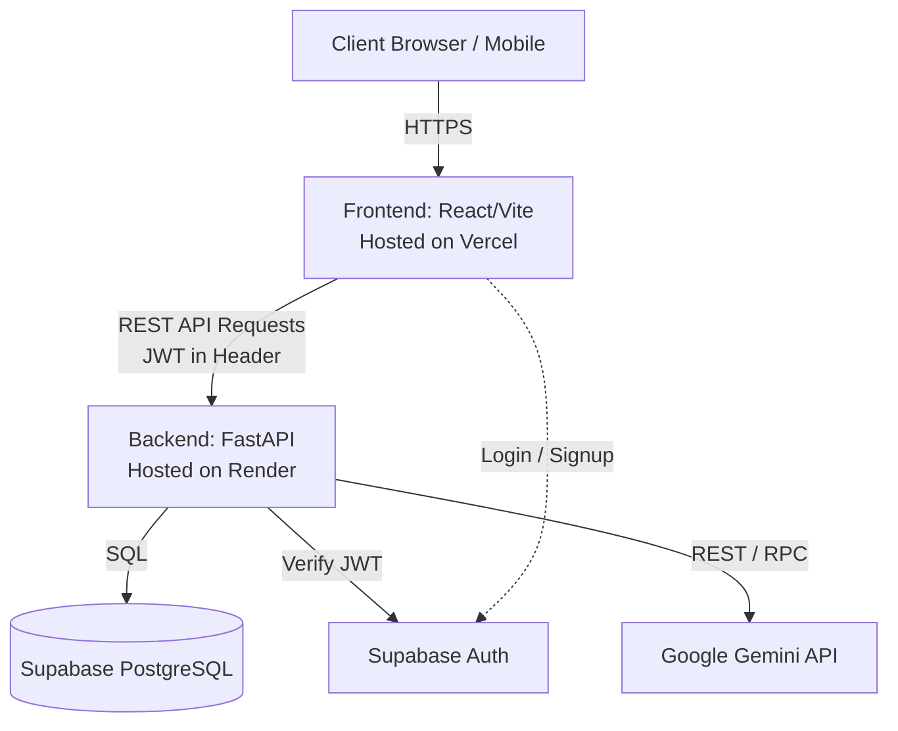
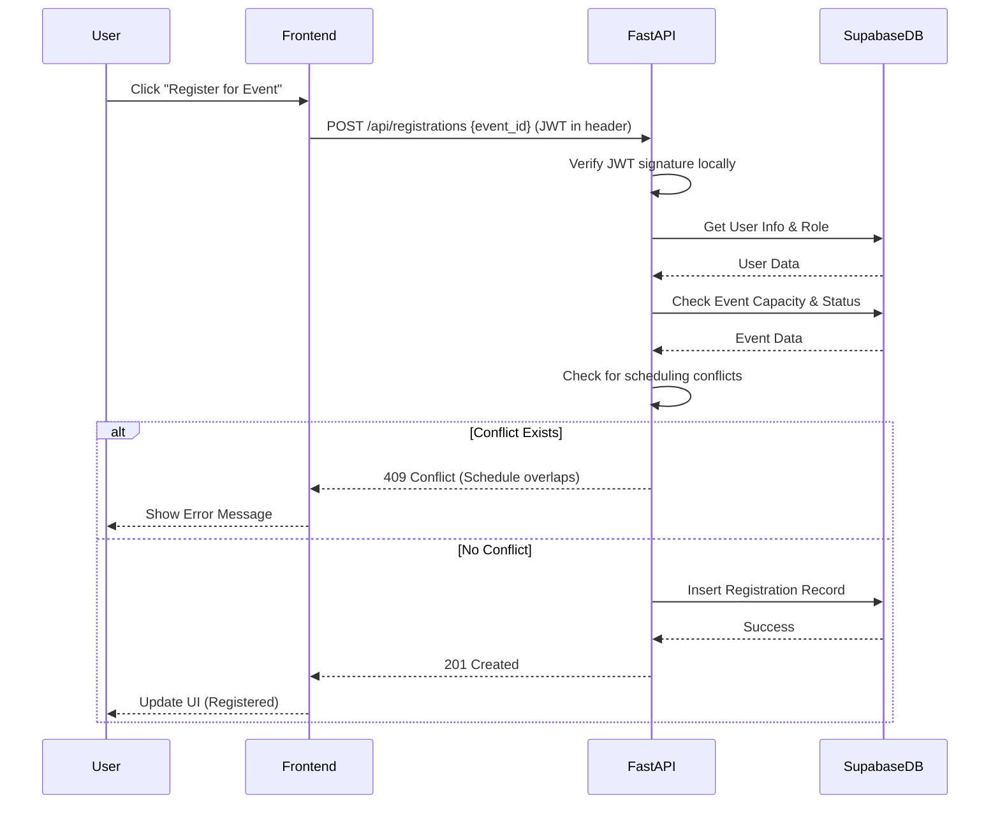

# Campus Event Platform Architecture

## System Overview

The Campus Event Platform is a full-stack web application designed to help students discover, manage, and register for campus events. It also provides tools for student organizations to create and manage their events, and features an AI-powered assistant for advanced search and recommendations.

The system is composed of the following major components:
- **Frontend**: A single-page application built with React, Vite, and Tailwind CSS.
- **Backend**: A RESTful API built with FastAPI and Python.
- **Database**: A PostgreSQL database hosted on Supabase, serving as the primary data store.
- **Authentication**: Supabase Auth handles user identity and token generation.
- **AI Services**: Google Gemini API powers the platform's AI features, including natural language search and smart recommendations.

## System Architecture Diagram



## Tech Stack Decisions and Rationale

| Component | Technology | Rationale |
| :--- | :--- | :--- |
| **Backend Framework** | FastAPI (Python 3.11+) | High performance, async support, built-in validation with Pydantic, automatic OpenAPI documentation. |
| **Database ORM** | SQLAlchemy 2.0 (async) + asyncpg | Robust ORM with excellent async support. `asyncpg` provides the fastest connection to PostgreSQL. |
| **Database Hosting** | Supabase (PostgreSQL) | Managed Postgres with built-in connection pooling, Auth, and Storage. Excellent developer experience. |
| **Authentication** | Supabase Auth | Secure, standard-compliant JWT-based authentication. Offloads the complexity of password management and OAuth flows. |
| **AI Provider** | Google Gemini API | Powerful LLM capabilities with structured output support via `google-genai` SDK. Cost-effective and fast for text tasks. |
| **Frontend** | React + Vite | Industry standard, massive ecosystem, fast development server and optimized build process. |

### Key Architectural Decisions

1. **Local JWT Verification**: The backend verifies Supabase JWTs locally using `PyJWKClient` or HS256 with the JWT secret, rather than making network calls to Supabase for every request. This reduces latency.
2. **Statement Caching Disabled**: For compatibility with Supabase's connection pooler, statement caching is disabled in SQLAlchemy (`connect_args={"statement_cache_size": 0, "prepared_statement_cache_size": 0}`).
3. **RBAC via FastAPI Dependencies**: Role-Based Access Control (RBAC) is implemented using FastAPI dependencies. The user's role is queried from the local `users` table rather than relying solely on JWT claims, allowing for immediate role updates without requiring token refresh.
4. **Structured AI Outputs**: AI features utilize the `google-genai` SDK with Pydantic models to enforce strict, predictable outputs from Gemini.
5. **AI Fallbacks**: All AI-driven features (like search and recommendations) have deterministic fallbacks. If the Gemini API is unavailable or times out, the system degrades gracefully to standard SQL-based search and basic heuristics.

## Data Flow

A typical request flows as follows:

1. **Client**: The user performs an action (e.g., clicks "Register"). The React frontend constructs an HTTP request.
2. **Auth Header**: The frontend attaches the current Supabase JWT to the `Authorization` header as a Bearer token.
3. **API Gateway / Server**: The request reaches the FastAPI server.
4. **Middleware / Dependencies**:
   - Rate limiting (`slowapi`) is checked.
   - The auth dependency extracts the JWT, verifies its signature locally, and extracts the `sub` (user ID).
   - If required, a database query fetches the user's role from the `users` table to ensure they have permission.
5. **Business Logic**: The router passes control to a service function, which implements the business rules (e.g., checking if the event is full, if the user has a scheduling conflict).
6. **Data Access**: The service uses an async SQLAlchemy session to execute SQL against Supabase PostgreSQL.
7. **Response**: Data is returned, validated and serialized by Pydantic, and sent back to the client as JSON.

## Event Registration Flow



## AI Architecture

The platform integrates Google Gemini to provide intelligent features.

### Usage
- **Natural Language Search**: Translating queries like "tech events this weekend with free food" into structured filters.
- **Smart Recommendations**: Analyzing a user's interests, past registrations, and bookmarks to suggest events.
- **Event Digest**: Generating a personalized summary of upcoming events for a user.

### Fallback Strategy
**Crucial constraint**: The platform must function even if the AI provider goes down.
- If `/api/search/natural` fails or times out, the frontend falls back to standard keyword/filter search (`/api/events`).
- If AI recommendations fail, the system falls back to a deterministic scoring model based on shared tags, department, and recency.
- Try/except blocks around all `client.aio.models.generate_content` calls ensure the application does not crash.

## Recommendation Engine

The system uses a transparent hybrid scoring model for recommending events. When the AI model is bypassed or fails, the fallback algorithm scores events as follows:

1. **Tag Match (+5 points per match)**: If the event has tags matching the user's explicit interests.
2. **Organization Affinity (+10 points)**: If the user is a member of the organization hosting the event.
3. **Past Attendance (+3 points per shared tag)**: Tags from events the user previously attended.
4. **Time Decay (Multiplier)**: Events happening sooner receive a slight multiplier (e.g., happening this week = 1.2x).

The top `N` highest-scoring events are returned.

## Natural Language Search

1. **Query Input**: User types "coding workshops tomorrow evening".
2. **Prompt Construction**: The backend builds a prompt containing the current date/time and the user's query.
3. **Structured Extraction**: Gemini is called using the `google-genai` SDK with `response_schema` set to a Pydantic model representing search filters (e.g., `start_date`, `end_date`, `tags`, `category`).
4. **Execution**: The extracted filters are mapped to the standard `/api/events` SQLAlchemy queries.

## Folder Structure

```text
backend/
├── app/
│   ├── api/            # FastAPI routers (endpoints) grouped by resource
│   ├── core/           # Config, security, dependencies, database connection
│   ├── models/         # SQLAlchemy ORM models
│   ├── schemas/        # Pydantic models (request/response validation)
│   ├── services/       # Business logic and database interactions
│   └── main.py         # FastAPI application entry point
├── tests/              # Pytest test suite
├── alembic/            # Database migration scripts
├── .env.example        # Example environment variables
├── requirements.txt    # Python dependencies
```
