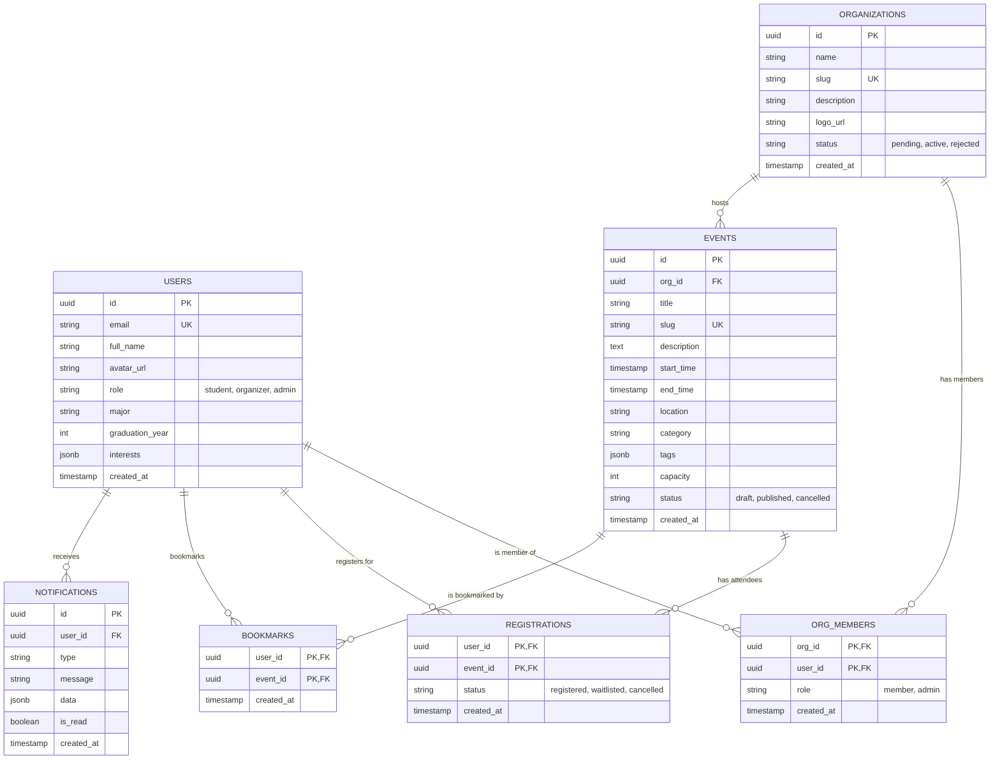

# Database Schema & Architecture

The Campus Event Platform uses PostgreSQL hosted on Supabase. We interact with it using async SQLAlchemy (`asyncpg`) from the FastAPI backend.

## Entity-Relationship Diagram

## Table Descriptions

### `users`
Stores user profile information. Authentication is handled by Supabase Auth, which maintains its own `auth.users` table. When a user signs up, a trigger or the backend creates a corresponding record in the public `users` table.
- **id**: UUID, matches `auth.users.id`.
- **role**: Enum/String defining platform access level (`student`, `organizer`, `admin`).

### `organizations`
Groups that can host events.
- **slug**: Unique URL-friendly string.
- **status**: Controls visibility. Must be `active` to host public events.

### `org_members`
Junction table linking users to organizations with specific roles (e.g., an org admin can edit org details and create events).

### `events`
The core entity.
- **capacity**: Integer limit for attendees. If `null`, capacity is unlimited.
- **tags**: JSONB array of strings for flexible categorization.

### `registrations`
Records a user's intent to attend an event.
- **Composite PK**: `(user_id, event_id)` prevents duplicate registrations.

### `bookmarks`
Events saved by users for later.
- **Composite PK**: `(user_id, event_id)`.

### `notifications`
In-app alerts for users (e.g., "Event cancelled", "Registration confirmed").

## Index Strategy

To ensure high performance for common queries, the following indexes are implemented (or should be):

1. **Foreign Keys**: Indexes on all foreign key columns (`org_id`, `user_id`, `event_id`).
2. **Lookup Fields**:
   - `events.slug` (UNIQUE)
   - `organizations.slug` (UNIQUE)
3. **Filtering & Sorting**:
   - `events.start_time` (often used to find upcoming events).
   - `events.status` (frequently filtered by `published`).
   - `events.category`
4. **JSONB / Array**: GIN indexes on `events.tags` and `users.interests` to speed up overlap queries and search.

## Constraints

- **Unique Constraints**: User emails, event slugs, org slugs.
- **Check Constraints**: `events.end_time > events.start_time`.
- **Referential Integrity**: Standard foreign key constraints with `ON DELETE CASCADE` where appropriate (e.g., deleting an event deletes its registrations and bookmarks).

## Migration Approach

Database migrations are managed in two potential ways depending on the environment setup:
1. **Raw SQL (`schema.sql`)**: Used primarily for initial Supabase project setup to quickly establish the core tables, RLS (Row Level Security) policies, and Supabase-specific functions.
2. **Alembic**: Used within the FastAPI app (`alembic/` directory) for incremental schema changes and version control of the database schema in Python.
